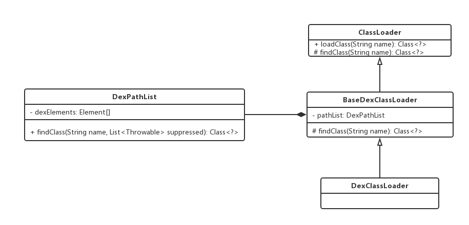

### 概述

>热修复即”打补丁“，当一个app上线后，如果发现重大的bug，需要紧急修复。常规的做法是修复bug，然后重新打包，再上线到各个渠道。这种方式的成本高，效率低。
>
>于是热修复技术应运而生，热修复技术一般的做法是应用启动的时候，主动去服务端查询是否有补丁包，有就下载下来，并在下一次启动的时候生效，这样就可以快速解决线上的紧急bug。

<!--more-->

> Android中的热修复包括：`代码修复`、`资源修复`、`动态链接库修复`。本文主要讲解代码修复。

### 热修复原理

>  代码修复的原理主要是类替换。类的替换就涉及到ClassLoader的使用，Android中可用来动态加载代码的ClassLoader有`PathClassLoader`、`DexClassLoader`。
>
> 因为PathClassLoader在Dalvik虚拟机中只能用来加载已安装apk的类，而DexClassLoader在Dalvik和ART虚拟机中都能加载未安装apk或者dex中的类，所以热修复使用DexClassLoader来加载补丁包中的类。



**ClassLoader.java**

```java
public abstract class ClassLoader {
    
    // ...
    
    public Class<?> loadClass(String name) throws ClassNotFoundException {
        return loadClass(name, false);
    }
    
    // 使用双亲委托的机制进行类的加载
    protected Class<?> loadClass(String name, boolean resolve) throws ClassNotFoundException {
        // 首先，从缓存中查找类是否已经加载
        Class<?> c = findLoadedClass(name);
        if (c == null) {
            try {
                if (parent != null) {
                    // 缓存找不到类，就委托给父加载器进行加载
                    c = parent.loadClass(name, false);
                } else {
                    // 没有父加载器，则委托给顶级的BootstrapClassLoader进行加载
                    c = findBootstrapClassOrNull(name);
                }
            } catch (ClassNotFoundException e) {
                // ClassNotFoundException thrown if class not found
                // from the non-null parent class loader
            }

            if (c == null) {
                // 如果还是没找到类，就主动从自己的加载路径中去查找
                c = findClass(name);
            }
        }
        return c;
    }
    
    // 这是ClassLoader主动加载类的方法，由子类具体实现
    protected Class<?> findClass(String name) throws ClassNotFoundException {
        throw new ClassNotFoundException(name);
    }
    
    // ...
    
}
```

**DexClassLoader.java**

```java
public class DexClassLoader extends BaseDexClassLoader {

    public DexClassLoader(String dexPath, String optimizedDirectory, String librarySearchPath, ClassLoader parent) {
        super(dexPath, null, librarySearchPath, parent);
    }
}
```

**BaseDexClassLoader.java**

```java
public class BaseDexClassLoader extends ClassLoader {
    // ...
    
    // dex文件的路径列表
    private final DexPathList pathList;
    
    @Override
    protected Class<?> findClass(String name) throws ClassNotFoundException {
        List<Throwable> suppressedExceptions = new ArrayList<Throwable>();
        Class c = pathList.findClass(name, suppressedExceptions);
        if (c == null) {
            ClassNotFoundException cnfe = new ClassNotFoundException("Didn't find class \"" + name + "\" on path: " + pathList);
            for (Throwable t : suppressedExceptions) {
                cnfe.addSuppressed(t);
            }
            throw cnfe;
        }
        return c;
    }
    // ...
}
```

**DexPathList.java**

```java
final class DexPathList {
    // ...
    
    // 每个元素代表着一个dex
    private Element[] dexElements;
    
    public Class<?> findClass(String name, List<Throwable> suppressed) {
        for (Element element : dexElements) {
            Class<?> clazz = element.findClass(name, definingContext, suppressed);
            if (clazz != null) {
                return clazz;
            }
        }

        if (dexElementsSuppressedExceptions != null) {
            suppressed.addAll(Arrays.asList(dexElementsSuppressedExceptions));
        }
        return null;
    }
    
    // ...
}
```

**说明**：

**通过上面几个类的关系，和类的查找过程，我们可以发现最终是通过遍历`DexPathList`的`dexElements`数组进行类的查找加载，当找到类就返回；**

**dexElements数组的每个元素都代表着一个dex文件，所以为了让补丁包中要替换的类抢先于有bug的类被加载，就需要将补丁包dex插入到`dexElements`数组的头部。**

### 热修复实战

#### 生成补丁dex文件

Step1. 修改待修复的Title类；

```java
package com.github.xch168.hotfixdemo;

/**
 * Created by XuCanHui on 2019/1/29.
 */
public class Title {

    public String getTitle() {
        return "hotfix title";
    }
}
```

Step2. 编译Title类

```bash
javac com/github/xch168/hotfixdemo/Title.java
```

Step3. 用`d8`命令将Title.class打包成`patch.dex`；

> `d8`命令的位置：&lt;sdk-dir&gt;/build-tools/&lt;versionName&gt;

```bash
d8 Title.class
```

命令执行完后就会生成一个`classes.dex`文件，将其重命名为`patch.dex`

Step4. 将`patch.dex`上传到[七牛云](portal.qiniu.com)的对象存储服务器上。

> patch.dex在七牛对象存储服务器上的外链：http://pm3fh7vxn.bkt.clouddn.com/patch.dex


#### 下载补丁包patch.dex

```java
public class HotfixHelper {

    public static void loadPatch(Context context, OnPatchLoadListener listener) {
        File patchFile = new File(context.getCacheDir() + "/patch.dex");
        if (patchFile.exists()) {
            patchFile.delete();
        }

        downloadPatch(patchFile, listener);
    }

    private static void downloadPatch(final File patchFile, final OnPatchLoadListener listener) {
        OkHttpClient client = new OkHttpClient();
        Request request = new Request.Builder()
                .url("http://pm3fh7vxn.bkt.clouddn.com/patch.dex")
                .get()
                .build();
        client.newCall(request)
              .enqueue(new Callback() {
                  @Override
                  public void onFailure(Call call, IOException e) {
                      if (listener != null) {
                          listener.onFailure();
                      }
                      e.printStackTrace();
                  }

                  @Override
                  public void onResponse(Call call, Response response) throws IOException {
                      if (response.code() == 200) {
                          FileOutputStream fos = new FileOutputStream(patchFile);
                          fos.write(response.body().bytes());
                          fos.close();
                          if (listener != null) {
                              listener.onSuccess();
                          }
                      } else {
                          if (listener != null) {
                              listener.onFailure();
                          }
                      }
                  }
              });
    }
}
```

#### 应用补丁包

```java
public class HotfixHelper {
    
        public static void applyPatch(Context context) {
        // 获取宿主的ClassLoader
        ClassLoader classLoader = context.getClassLoader();
        Class loaderClass = BaseDexClassLoader.class;
        try {
            // 获取宿主ClassLoader的pathList对象
            Object hostPathList = ReflectUtil.getField(loaderClass, classLoader, "pathList");
            // 获取宿主pathList对象中的dexElements数组对象
            Object hostDexElement = ReflectUtil.getField(hostPathList.getClass(), hostPathList, "dexElements");

            File optimizeDir = new File(context.getCacheDir() + "/optimize");
            if (!optimizeDir.exists()) {
                optimizeDir.mkdir();
            }
            // 创建补丁包的类加载器
            DexClassLoader patchClassLoader = new DexClassLoader(context.getCacheDir() + "/patch.dex", optimizeDir.getPath(), null, classLoader);
            // 获取补丁ClassLoader中的pathList对象
            Object patchPathList = ReflectUtil.getField(loaderClass, patchClassLoader, "pathList");
            // 获取补丁pathList对象中的dexElements数组对象
            Object patchDexElement = ReflectUtil.getField(patchPathList.getClass(), patchPathList, "dexElements");

            // 合并宿主中的dexElements和补丁中的dexElements，并把补丁的dexElements放在数组的头部
            Object newDexElements = combineArray(hostDexElement, patchDexElement);
            // 将合并完成的dexElements设置到宿主ClassLoader中去
            ReflectUtil.setField(hostPathList.getClass(), hostPathList, "dexElements", newDexElements);
        } catch (NoSuchFieldException e) {
            e.printStackTrace();
        } catch (IllegalAccessException e) {
            e.printStackTrace();
        }
    }

    /**
     *
     * @param hostElements    宿主中的dexElements
     * @param patchElements   补丁包中的dexElements
     * @return Object         合并成的dexElements
     */
    private static Object combineArray(Object hostElements, Object patchElements) {
        Class<?> componentType = hostElements.getClass().getComponentType();
        int i = Array.getLength(hostElements);
        int j = Array.getLength(patchElements);
        int k = i + j;
        Object result = Array.newInstance(componentType, k);
        // 将补丁包的dexElements合并到头部
        System.arraycopy(patchElements, 0, result, 0, j);
        System.arraycopy(hostElements, 0, result, j, i);
        return result;
    }
}
```

在Application中应用补丁包，这里是应用启动最新调用的地方。

```java
public class App extends Application {

    @Override
    protected void attachBaseContext(Context base) {
        super.attachBaseContext(base);

        if (HotfixHelper.hasPatch(base)) {
            HotfixHelper.applyPatch(base);
        }
    }
}
```

#### 测试流程

Step1.  启动应用，下载补丁包；

Step2. 杀掉应用，然后重启应用。


---

Demo地址：https://github.com/xch168/HotfixDemo


### 参考链接

1. [一步步手动实现热修复(一)-dex文件的生成与加载](https://blog.csdn.net/sahadev_/article/details/53318251)
2. [一步步手动实现热修复(二)-类的加载机制简要介绍](https://blog.csdn.net/sahadev_/article/details/53334911)
3. [一步步手动实现热修复(三)-Class文件的替换](https://blog.csdn.net/sahadev_/article/details/53363052)
4. [Android热修复原理（一）热修复框架对比和代码修复](https://blog.csdn.net/itachi85/article/details/79522200)
5. [Android 热修复，没你想的那么难](https://kymjs.com/code/2016/05/08/01/)
6. [HenCoderPlus](https://github.com/rengwuxian/HenCoderPlus/tree/master/27_hot_update)

