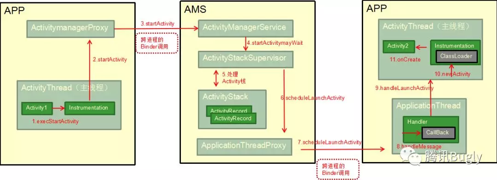
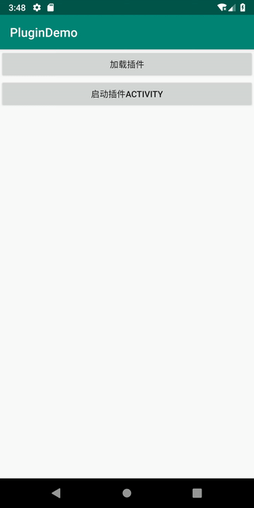

### 概述

>Android插件化技术，可以实现功能模块的按需加载和动态更新，其本质是动态加载未安装的apk。

<!--more-->

> 本文涉及源码为API 28

### 插件化原理

> 插件化要解决的三个核心问题：`类加载`、`资源加载`、`组件生命周期管理`。

#### 类加载

> Android中常用的两种类加载器：`PathClassLoader`和`DexClassLoader`，它们都继承于BaseDexClassLoader。

```java
// PathClassLoader.java
public class PathClassLoader extends BaseDexClassLoader {
    public PathClassLoader(String dexPath, ClassLoader parent) {
        super(dexPath, null, null, parent);
    }
    
    public PathClassLoader(String dexPath, String librarySearchPath, ClassLoader parent) {
        super(dexPath, null, librarySearchPath, parent);
    }
}

// DexClassLoader.java
public class DexClassLoader extends BaseDexClassLoader {
    public DexClassLoader(String dexPath, String optimizedDirectory, String librarySearchPath, ClassLoader parent) {
        super(dexPath, null, librarySearchPath, parent);
    }
}
```

**说明**：

- DexClassLoader的构造函数比PathClassLoader多了一个，`optimizedDirectory`参数，这个是用来指定dex的优化产物odex的路径，在源码注释中，指出这个参数从API 26后就弃用了。
- PathClassLoader主要用来加载系统类和应用程序的类，在ART虚拟机上可以加载未安装的apk的dex，在Dalvik则不行。
- DexClassLoader用来加载未安装apk的dex。

#### 资源加载

> Android系统通过Resource对象加载资源，因此只需要添加资源（即apk文件）所在路径到`AssetManager`中，即可实现对插件资源的访问。

```java
// 创建AssetManager对象
AssetManager assetManager = new AssetManager();
// 将apk路径添加到AssetManager中
if (assetManager.addAssetPath(apkPath) == 0) {
    return null;
}
// 创建插件Resource对象
Resources pluginResources = new Resources(assetManager, metrics, getConfiguration());
```

**说明**：由于AssetManager的构造方法时`hide`的，需要通过反射区创建。

#### 组件生命周期管理

> 对于Android来说，并不是说类加载进来就可以使用了，很多组件都是有“生命”的；因此对于这些有血有肉的类，必须给他们注入活力，也就是所谓的`组件生命周期管理`。

在解决插件中组件的生命周期，通常的做法是通过`Hook`相应的系统对象，实现欺上瞒下，后面将通过Activity的插件化来进行讲解。


### Activity插件化

> 四大组件的插件化是插件化技术的核心知识点，而Activity插件化更是重中之中，Activity插件化的主流实现方式是通过`Hook技术`实现。

#### Activity的启动过程



上图列出的是启动一个Activity的主要过程，具体步骤如下：

1. Activity1调用startActivity，实际会调用`Instrumentation`类的`execStartActivity`方法，Instrumentation是系统用来监控Activity运行的一个类，Activity的整个生命周期都有它的影子。
2. 通过跨进程的binder调用，进入到`ActivityManagerService`（AMS）中，其内部会处理Activity栈。之后又通过跨进程调用进入到Activity2所在的进程中。
3. `ApplicationThread`是一个binder对象，其运行在binder线程池中，内部包含一个`H`类，该类继承于Handler。ApplicationThread将启动Activity2的信息通过H对象发送给主线程。
4. 主线程拿到Activity2的信息后，调用Instrumentation类的`newAcitivity`方法，其内部通过ClassLoader创建Activity2实例。

#### 加载插件中的类

```java
public class PluginHelper {

    private static final String TAG = "PluginHelper";

    private static final String CLASS_DEX_PATH_LIST = "dalvik.system.DexPathList";
    private static final String FIELD_PATH_LIST = "pathList";
    private static final String FIELD_DEX_ELEMENTS = "dexElements";
    
       private static void loadPluginClass(Context context, ClassLoader hostClassLoader) throws Exception {
        // Step1. 获取到插件apk，通常都是从网络上下载，这里为了演示，直接将插件apk push到手机
        File pluginFile = context.getExternalFilesDir("plugin");
        Log.i(TAG, "pluginPath:" + pluginFile.getAbsolutePath());
        if (pluginFile == null || !pluginFile.exists() || pluginFile.listFiles().length == 0) {
            Toast.makeText(context, "插件文件不存在", Toast.LENGTH_SHORT).show();
            return;
        }
        pluginFile = pluginFile.listFiles()[0];
        // Step2. 创建插件的DexClassLoader
        DexClassLoader pluginClassLoader = new DexClassLoader(pluginFile.getAbsolutePath(), null, null, hostClassLoader);
        // Step3. 通过反射获取到pluginClassLoader中的pathList字段
        Object pluginDexPathList = ReflectUtil.getField(BaseDexClassLoader.class, pluginClassLoader, FIELD_PATH_LIST);
        // Step4. 通过反射获取到DexPathList的dexElements字段
        Object pluginElements = ReflectUtil.getField(Class.forName(CLASS_DEX_PATH_LIST), pluginDexPathList, FIELD_DEX_ELEMENTS);

        // Step5. 通过反射获取到宿主工程中ClassLoader的pathList字段
        Object hostDexPathList = ReflectUtil.getField(BaseDexClassLoader.class, hostClassLoader, FIELD_PATH_LIST);
        // Step6. 通过反射获取到宿主工程中DexPathList的dexElements字段
        Object hostElements = ReflectUtil.getField(Class.forName(CLASS_DEX_PATH_LIST), hostDexPathList, FIELD_DEX_ELEMENTS);
        
        // Step7. 将插件ClassLoader中的dexElements合并到宿主ClassLoader的dexElements
        Object array = combineArray(hostElements, pluginElements);
        
        // Step8. 将合并的dexElements设置到宿主ClassLoader
        ReflectUtil.setField(Class.forName(CLASS_DEX_PATH_LIST), hostDexPathList, FIELD_DEX_ELEMENTS, array);
    }
}
```

#### 处理插件Activity的启动

>在Android中，Activity的启动需要在`AndroidManifest.xml`中配置，如果没有配置的话，就会报`ActivityNotFoundException`异常，而插件的Activity无法再宿主AndroidManifest中注册。在上面的Activity的启动流程图，Activity的启动是要经过AMS的校验的，所以就需要对AMS下功夫。

Step1. 在宿主工程的AndroidManifest.xml中预先注册Activity进行占坑。

```xml
<?xml version="1.0" encoding="utf-8"?>
<manifest xmlns:android="http://schemas.android.com/apk/res/android"
    xmlns:tools="http://schemas.android.com/tools"
    package="com.github.xch168.plugindemo">

    <application>
        
        <!--占坑Activity，不需要创建类-->
        <activity android:name=".StubActivity" />
    </application>

</manifest>
```

Step2. 使用占坑Activity绕过AMS验证。

> Activity的启动，实际会调用`Instrumentation`类的`execStartActvity`方法，所以可以对其进行hook，将启动插件Activity的Intent替换成宿主预注册的插桩Activity，从而绕过ASM的验证。

Instrumentation代理类：

```java
public class InstrumentationProxy extends Instrumentation {

    private Instrumentation mInstrumentation;
    private PackageManager mPackageManager;

    public InstrumentationProxy(Instrumentation instrumentation, PackageManager packageManager) {
        mInstrumentation = instrumentation;
        mPackageManager = packageManager;
    }

    public ActivityResult execStartActivity(Context who, IBinder contextThread, IBinder token, Activity target, Intent intent, int requestCode, Bundle options) {
        List<ResolveInfo> infos = mPackageManager.queryIntentActivities(intent, PackageManager.MATCH_ALL);
        if (infos == null || infos.size() == 0) {
            // 保存要启动的插件Activity的类名
            intent.putExtra(HookHelper.TARGET_INTENT, intent.getComponent().getClassName());
            // 构建插桩Activity的Intent
            intent.setClassName(who, "com.github.xch168.plugindemo.StubActivity");
        }
        try {
            Method execMethod = Instrumentation.class.getDeclaredMethod("execStartActivity", Context.class, IBinder.class, IBinder.class, Activity.class, Intent.class, int.class, Bundle.class);
            // 将插桩Activity的Intent传给ASM验证
            return (ActivityResult) execMethod.invoke(mInstrumentation, who, contextThread, token, target, intent, requestCode, options);
        } catch (Exception e) {
            e.printStackTrace();
        }
        return null;
    }
}
```

Hook:

```java
public class HookHelper {
    public static final String TARGET_INTENT = "target_intent";
    
    public static void hookInstrumentation(Context context) throws Exception {
        Class<?> contextImplClass = Class.forName("android.app.ContextImpl");
        Object activityThread = ReflectUtil.getField(contextImplClass, context, "mMainThread");
        Class<?> activityThreadClass = Class.forName("android.app.ActivityThread");
        Object mInstrumentation = ReflectUtil.getField(activityThreadClass, activityThread, "mInstrumentation");
        // 用代理Instrumentation来替换mMainThread中的mInstrumentation，从而接管Instrumentation的任务
        ReflectUtil.setField(activityThreadClass, activityThread, "mInstrumentation", new InstrumentationProxy((Instrumentation) mInstrumentation, context.getPackageManager()));
    }
}
```

Step3. 还原插件Activity

> 上面我们使用插桩Activity来绕过ASM的验证，接下来的步骤会创建`StubActivity`实例，会找不到类，并且我们要启动的是插件Activity而不是插桩Activity，所以就需要对Intent进行还原。
>
> 在Activity启动流程第10步，通过插件的ClassLoader反射创建插件Activity，所以可以在这hook进行还原。

```java
public class InstrumentationProxy extends Instrumentation {
    // ...
    
    public Activity newActivity(ClassLoader cl, String className, Intent intent) throws IllegalAccessException, InstantiationException, ClassNotFoundException {
        // 获取插件Activity的类名
        String intentName = intent.getStringExtra(HookHelper.TARGET_INTENT);
        if (!TextUtils.isEmpty(intentName)) {
            // 创建插件Activity实例
            return super.newActivity(cl, intentName, intent);
        }
        return super.newActivity(cl, className, intent);
    }
}
```

Step4. 在Application中hook Instrumentation。

```java
public class App extends Application {

    @Override
    protected void attachBaseContext(Context base) {
        super.attachBaseContext(base);

        try {
            HookHelper.hookInstrumentation(base);
        } catch (Exception e) {
            e.printStackTrace();
        }
    }
}
```
#### 处理插件Activity的生命周期

> 经过上面的处理后，插件Activity可以启动了，但是是否具有生命周期呢？接下来通过源码来探索一下。

Activity的`finish`方法可以触发Activity生命周期的变化。

```java
public void finish() {
    finish(DONT_FINISH_TASK_WITH_ACTIVITY);
}

private void finish(int finishTask) {
    // ...
    
    // mToken是该Activity的标识
    if (ActivityManager.getService().finishActivity(mToken, resultCode, resultData, finishTask)) {
        mFinished = true;
    }
}
```

**说明**：

- 调用ASM的finishActivity方法，接着ASM通过ApplicationThread调用ActivityThread。
- ActivityThread最终会调用performDestroyActivity方法。

```java
public final class ActivityThread extends ClientTransactionHandler {
    // ...
    
    ActivityClientRecord performDestroyActivity(IBinder token, boolean finishing, int configChanges, boolean getNonConfigInstance, String reason) {
    
    	// 获取保存到token的Activity
    	mInstrumentation.callActivityOnDestroy(r.activity);
    }
}
```

token中的Activity是从何而来呢？解析来我们来看看ActivityThread的performLaunchActivity方法。

```java
public final class ActivityThread extends ClientTransactionHandler {
    
    private Activity performLaunchActivity(ActivityClientRecord r, Intent customIntent) {
        
        // ...
        activity = mInstrumentation.newActivity(cl, component.getClassName(), r.intent);
        
        r.activity = activity;
        
        mActivities.put(r.token, r);
    }
}
```

**说明**：在performLaunchActivity方法中，会将当前启动的Activity放在token中的activity属性，并将其置于mActivities中，而mInstrumentation的newActivity方法已经被我们hook了，所以该activity即为插件Activity，后续各个生命周期的调用都会通知给插件Activity。

#### 加载插件中的资源

> 当插件Activity创建的时候会调用`setContentView`通过id去操作布局，因为凡是通过id去获取资源的方式都是通过`Resources`去获取的。但是宿主apk不知道到插件apk的存在，所以宿主Resources也无法加载插件apk的资源。因此需要为插件apk构建一个`Resources`，然后插件apk中都通过这个Resource区获取资源。

```java
public class PluginHelper {

    private static Resources sPluginResources;
    
    public static void initPluginResource(Context context) throws Exception {
        Class<AssetManager> clazz = AssetManager.class;
        AssetManager assetManager = clazz.newInstance();
        Method method = clazz.getMethod("addAssetPath", String.class);
        method.invoke(assetManager, context.getExternalFilesDir("plugin").listFiles()[0].getAbsolutePath());
        sPluginResources = new Resources(assetManager, context.getResources().getDisplayMetrics(), context.getResources().getConfiguration());
    }
    
    public static Resources getPluginResources() {
        return sPluginResources;
    }
}
```

```java
public class App extends Application {
    
    @Override
    public Resources getResources() {
        return PluginHelper.getPluginResources() == null ? super.getResources() : PluginHelper.getPluginResources();
    }
}
```

**说明**：在Application中重写`getResources`，并返回插件的Resources，因为插件apk中的四大组件实际都是在宿主apk创建的，那么他们拿到的Application实际上都是宿主的，所以它们只需要通过`getApplication().getResources()`就可以非常方便的拿到插件的Resource。

#### 插件工程

插件工程比较简单，就一个Activity。

```java
public class PluginActivity extends AppCompatActivity {

    @Override
    protected void onCreate(Bundle savedInstanceState) {
        super.onCreate(savedInstanceState);
        setContentView(R.layout.activity_plugin);
    }

    @Override
    public Resources getResources() {
        return getApplication() != null && getApplication().getResources() != null ? getApplication().getResources() : super.getResources();
    }
}
```

**说明**：重写`getResources`方法，并返回插件Resources，因为需要通过插件Resources才能用id去操作资源文件。

### 测试

Step1. 将插件项目打包成apk；

Step2. 通过adb命令`adb push <local> <remote>`将apk推送到手机；

Step3. 宿主应用加载插件apk。




### 总结

插件化要处理的细节非常多，不仅要适配不同版本的Android系统，还要适配国产的各种ROM。要深入学习插件化的各种解决方案，可以去探索开源的插件化框架。

2018年Android 9.0上Android开始对私有API的使用进行限制，所以后面插件化可能退出历史主流，但是了解插件化涉及到的知识和技术，可以更好的理解Android系统。

------

Demo地址：https://github.com/xch168/PluginDemo

### 参考链接

1. [《Android插件化技术——原理篇》](https://mp.weixin.qq.com/s/Uwr6Rimc7Gpnq4wMFZSAag)
2. [Android插件化初体验](https://blog.csdn.net/zly921112/article/details/85287437)
3. [Android apk动态加载机制的研究](https://blog.csdn.net/singwhatiwanna/article/details/22597587)
4. [VirtualAPK资源加载原理解析](https://www.notion.so/VirtualAPK-1fce1a910c424937acde9528d2acd537)
5. [Android插件化原理（一）Activity插件化](https://blog.csdn.net/itachi85/article/details/80574390)
6. [Android 插件化：从入门到放弃](https://www.infoq.cn/article/android-plug-ins-from-entry-to-give-up)
7. [自己动手写Android插件化框架](https://www.jianshu.com/p/3260baad0979)
8. [插件化之代码调用与加载资源](https://www.jianshu.com/p/1bf0fd8d057c)
9. [Android插件化原理解析——概要](http://weishu.me/2016/01/28/understand-plugin-framework-overview/)
10. [Android 插件技术实战总结](https://mp.weixin.qq.com/s/1p5Y0f5XdVXN2EZYT0AM_A)