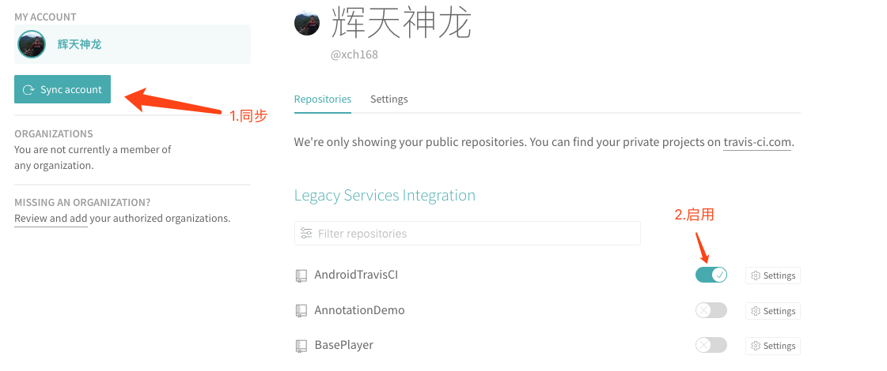
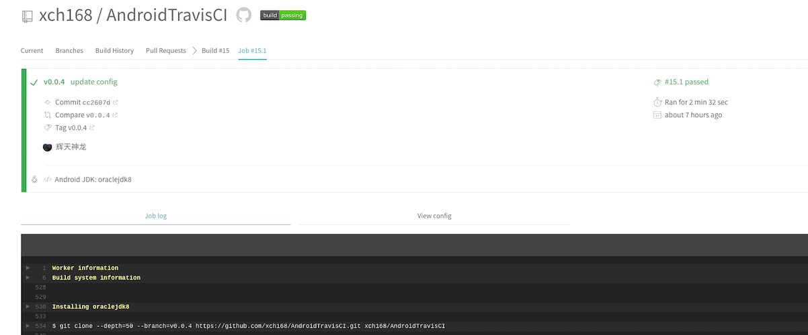
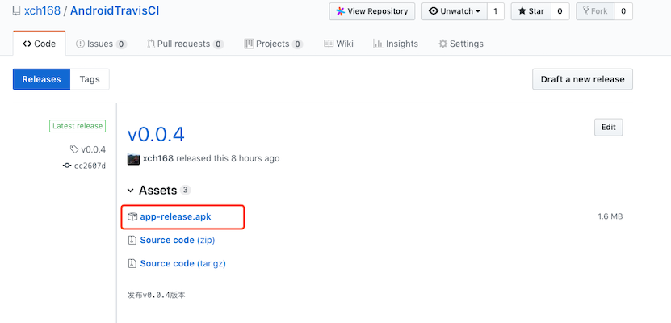
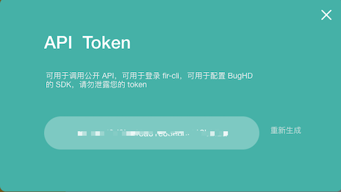
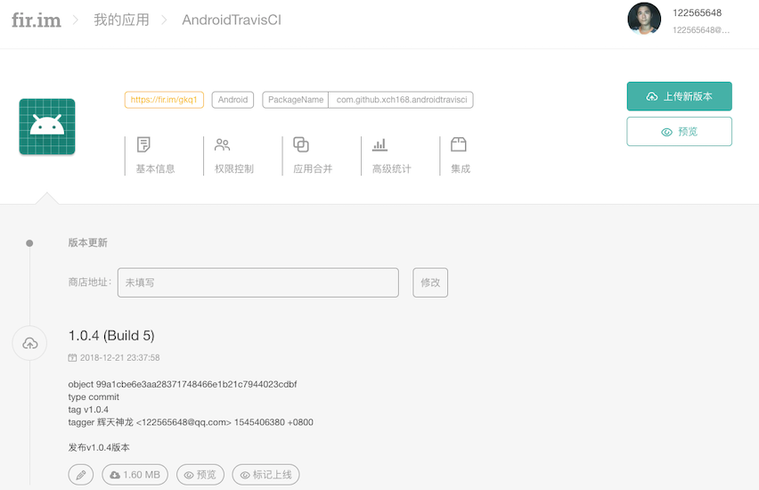

### 概述

>编写代码只是软件开发的一小部分，更多的时间往往花在构建（build）和测试（test）。
>
>为了提高软件开发的效率，构建和测试的自动化工具层出不穷，Travis就是这类工具，用好这个工具不仅可以提高效率，还能使开发流程更可靠和专业。

<!--more-->

### CI简介

> CI（Continuous Integration，持续集成）：指的是只要代码有变更，就自动运行构建和测试，反馈运行结果。确保符合预期以后，再将新代码集成到主干。
>
> 持续集成的好处在于，每次代码的小幅变更，就能看到运行结果，从而不断累积小的变更，而不是在开发周期结束时，一下子合并一大块代码。

### Travis-CI简介

> Travis CI提供的是持续集成服务。它绑定GitHub上面的项目，只要有新的代码，就会自动抓取，然后，提供一个运行环境，执行测试，完成构建，还能部署到服务器。

> Travis CI与Github结合比较紧密，对GitHub上的开源Repo是免费的，私有Repo收费。

免费Travis-CI：https://travis-ci.org

收费Travis-CI：https://travis-ci.com

### 启用Travis CI

Step1：使用GitHub账户授权登录Travis CI。

Step2：同步GitHub上的库，对指定的库启用Travis CI



### 配置.travis.yml

>Travis要求项目的根目录下面，必须有一个`.travis.yml`文件。这是配置文件，指定了Travis的行为。该文件必须保存在GitHub仓库里面，一旦代码仓库有新的Commit，Travis就会去找这个文件，执行里面的命令。

```yaml
language: android
jdk: oraclejdk8

# 开启基于容器的Travis CI任务，让编译效率更高
sudo: false


android:
  components:
    # 构建项目所用的BuildTools版本
    - build-tools-28.0.3
    # 用来编译项目的SDK版本
    - android-28

    # 添加Android Support Repository组件
    - extra-android-m2repository
    # 添加Support Library组件
    - extra-android-support


before_script:
  - chmod +x gradlew


script:
  # 生成release apk包
  - ./gradlew assembleRelease

```

### 保证自动化构建的密码和证书安全

> Android项目发布需要证书文件和密码，将原始正常和密码放入到代码库是很不安全的。
>
> Travis CI为此提供了两种解决方案：
>
> 1. 对敏感信息、密码、证书等进行对称加密，在CI构建环境时进行解密；
> 2. 将密码等通过Travis CI的控制台设置为构建时的环境变量。

#### 加密签名证书

> 因为Travis CI控制台无法上传文件，因此涉及到文件加密的部分，选择第一种方案。

Step1：本地安装Travis CLI命令行工具

```bash
gem install travis
```

Step2：命令行登录Travis（第一次登录才要），并输入GitHub的用户名和密码

```bash
travis login --org
```

Step3：进入项目根目录，加密证书

```bash
travis encrypt-file xch_android.jks --add
```

**命令执行结果**：

1. 在Travis CI控制台自动生成一对秘钥，形如：`encrypted_d71df9144721_iv`、`encrypted_d71df9144721_key`

   

2. 基于秘钥通过`openssl`对文件进行加密，并在根目录生成`xch_android.jks.enc`文件

3. 在`.travis.yml`中自动生成Travis CI环境下解密文件的配置。

   ```yaml
   before_install:
     - openssl aes-256-cbc -K $encrypted_d71df9144721_key -iv $encrypted_d71df9144721_iv
       -in xch_android.jks.enc -out xch_android.jks -d
   ```

#### 加密证书密码

Step1. 在Travis CI控制台配置`KEYSTORE_PASS`、`ALIAS_NAME`、`ALIAS_PASS`三个环境变量。


Step2. 在项目的根目录下创建一个名为`keystore.properties`文件（用于本地命令打包），并包含以下信息：

```properties
KEYSTORE_PASS=myStorePassword
ALIAS_NAME=myKeyAlias
ALIAS_PASS=myKeyPassword
```

Step3. 在`app` module 的`build.gradle`配置签名信息，`System.getenv()`用来获取Travis CI控制台配置的变量。

```groovy
apply plugin: 'com.android.application'

// 加载本地keystore.properties中的签名配置
def keyPropertiesFile = rootProject.file("keystore.properties")
def keyProperties = new Properties()
if (keyPropertiesFile.exists()) {
    keyProperties.load(new FileInputStream(keyPropertiesFile))
}

android {
    compileSdkVersion 28
    defaultConfig {
        applicationId "com.github.xch168.androidtravisci"
        minSdkVersion 16
        targetSdkVersion 28
        versionCode 1
        versionName "1.0"
        testInstrumentationRunner "android.support.test.runner.AndroidJUnitRunner"
    }
    signingConfigs {
        release {
            storeFile     file("../xch_android.jks")
            storePassword keyProperties.containsKey("KEYSTORE_PASS") ? keyProperties['KEYSTORE_PASS'] : System.getenv("KEYSTORE_PASS")
            keyAlias      keyProperties.containsKey("ALIAS_NAME")    ? keyProperties['ALIAS_NAME']    : System.getenv("ALIAS_NAME")
            keyPassword   keyProperties.containsKey("ALIAS_PASS")    ? keyProperties['ALIAS_PASS']    : System.getenv("ALIAS_PASS")
        }
    }
    buildTypes {
        release {
            minifyEnabled false
            signingConfig signingConfigs.release
            proguardFiles getDefaultProguardFile('proguard-android.txt'), 'proguard-rules.pro'
        }
    }
}
```

### 配置缓存机制

> Travis CI在每次构建完成后，就会删除所有文件，设置缓存机制，可以保证规定的缓存文件不需要每次下载，提高每次构建的速度；但是如果在更好的基础配置的情况（比如更新Gradle版本等，建议先清除缓存在跑CI）。

在`.travis.yml`文件添加如下配置：

```yaml
before_cache: 
- rm -f $HOME/.gradle/caches/modules-2/modules-2.lock
- rm -fr $HOME/.gradle/caches/*/plugin-resolution/
cache:                   #指定缓存目录
directories:
- $HOME/.gradle/caches/
- $HOME/.gradle/wrapper/
- $HOME/.android/build-cache
```

可以在后台手动删除Travis CI Cache：


### Travis CI自动发布apk到GitHub Release

Step1. 执行travis命令自动生成deploy配置

```bash
travis setup releases
```


命令执行完后会自动在`.travis.yml`添加如下配置：

```yaml
deploy:
  provider: releases
  api_key:
    secure: b7dhz7j5tY73qbQo2GNccev7NgI6BNWNeEpEfmLTxRZ7DJptxtQuJIHF026zhHtXfRom/pSXw7qlRJXamPWl7Bc1i1lUNKX7Mdt3Fo7Z70ZAyT/6vak3EGlKqDU7Ta96MOB2+5+2nQ7nlTX4kkkeObSTbD6py4eUzktoxsPSwtjiWrq7KM4KgcJTAEGnZx4LJdFm6pgE3drkbN83J0ZP3fT7sf+5Ggv4WLa8y3l/gM3rQ0tARebDo4OuigJOmknOfcxkiAlTtVt1qw1STMaW4H/M47K1mSvQK9DxSHUCD7ngvxEJlUMtqvYSIqQItyT7D8SvDxUqpZZM6y6qAcp+q5qrnA/uC7Qa3kju3skH1XBXyA20TN/pLYKk1yuH7TLg9W+512Pmgtpr4AiZayChnNn4morhhhncsdnQf1T6ziWUNGHmMK8QcUzjBdZHOVsNHGUuaGk4hOPeTRi7ozHYMnNF1E8HJEhtLf7/BHH4o17x5wI2QuSmgwqlCbhAYEwL8m9ZtyJ7saqimGo6m37XfBlomBgaTMrCDIybqOABjPxASlMVRh84XZeeAHHLgjSRMoP2cb+lksiyhO2TsCOvQEOmofFcjj4+iN+qIynPMb3bonuce/iD9nNC2cusibYaIrr1+r2VWE61EdIiLlamw99fFT1VZtliJuJe9tugMgA=
  file: app/build/outputs/apk/app-release.apk
  # 这句手动添加
  skip_cleanup: true
  on:
    repo: xch168/AndroidTravisCI
    # 这句手动添加
    tags: true
```

**说明**：

- `provider`：发布目标为GitHub Release，除了GitHub外，Travis CI还支持发布到AWS、Google App Engine等数十种provider。
- `secure`：是加密后的GitHub Access Token。
- `file`：发布的文件。
- `skip_cleanup`：默认情况下Travis CI在完成编译后会清除所有生成的文件，因此要将`skip_cleanup`设置为`true`来忽略此操作。
- `on`：发布的时机，这里配置为`tags: true`，即只在有`tag`的情况才发布。

Step2: 打`tag`

```bash
git tag -a v0.0.1-alpha.1 -m "这里是Tag注释，说清楚这个版本的主要改动，也可以省略-m参数直接写长文本"
git push origin --tags
```

Step3: 自动化构建、部署

- 当打完tag并推送到GitHub仓库时，就会触发Travis CI任务。



- 当Travis CI任务执行成功后，在GitHub就能看到发布的apk。

  

### 上传apk到蒲公英

> 蒲公英是APP内测分发平台，提供免费的APP内测分发托管，不但允许游客下载，还提供了二维码，下载速度快。

Step1. 使用GitHub授权登录https://www.pgyer.com/user/login

Step2. 获取API Key


Step3. 将获取的API Key配置到Travis CI的环境变量`PGYER_API_KEY`：


Step4. 在`.travis.yml`文件中，添加如下配置：

```yaml
# 添加蒲公英上传脚本
before_install:
- cd $TRAVIS_BUILD_DIR
- wget -c https://raw.githubusercontent.com/Pgyer/TravisFile/master/pgyer_upload.sh
 -O pgyer_upload.sh
- chmod +x pgyer_upload.sh

# 在apk上传到GitHub后，使用蒲公英的上传脚本将apk上传到蒲公英
after_deploy:
 - set -e
 - $TRAVIS_BUILD_DIR/pgyer_upload.sh "${TRAVIS_BUILD_DIR}/app/build/outputs/apk/release/app-release.apk" $PGYER_API_KEY
```

Step5. 打完tag，Travis CI自动构建后，将在蒲公英的控制台看到上传的apk


### 上传apk到fir.im

> fir.im和蒲公英的一样，都是免费的应用内测分发平台。

Step1. 登录https://fir.im/

Step2. 获取API Token。



Step3. 将获取的API Token配置到Travis CI的环境变量`FIR_API_TOKEN`。

Step4. 在`.travis.yml`文件中，添加如下配置：

```yaml
before_install:
- gem install fir-cli
after_deploy:
- fir p app/build/outputs/apk/release/app-release.apk -T $FIR_API_TOKEN -c "`git cat-file tag $TRAVIS_TAG`"
```

Step5. 打完tag，Travis CI自动构建后，将在fir.im的控制台看到上传的apk



[本文Demo](https://github.com/xch168/AndroidTravisCI)

### 参考链接

1. [[基于Travis CI搭建Android自动打包发布工作流](https://avnpc.com/p/197)](https://avnpc.com/pages/android-auto-deploy-workflow-on-travis-ci)
2. [用TRAVIS CI给ANDROID项目部署GITHUB RELEASE](http://kescoode.com/travis-ci-android-github-release/)
3. [持续集成服务 Travis CI 教程](http://www.ruanyifeng.com/blog/2017/12/travis_ci_tutorial.html)
4. [如何给你github上的Android项目添加travis-ci](https://www.jianshu.com/p/2935b96d3059)
5. [如何简单入门使用 Travis-CI 持续集成](https://juejin.im/entry/57070b048ac247004c0e3d8f)
6. [使用Travis-CI构建Android项目并自动打包部署到GitHub-Release](https://fandean.github.io/blog/2017/07/31/%E4%BD%BF%E7%94%A8Travis-CI%E6%9E%84%E5%BB%BAAndroid%E9%A1%B9%E7%9B%AE%E5%B9%B6%E8%87%AA%E5%8A%A8%E6%89%93%E5%8C%85%E9%83%A8%E7%BD%B2%E5%88%B0GitHub-Release/)
7. [基于Travis CI搭建Android持续集成以及自动打包发布流程](https://www.jianshu.com/p/6dba7d6f79ff)
8. [Android Travis CI与fir.im、GitHub集成](https://www.jianshu.com/p/745bea00dba7)
9. [使用 Travis CI 实现持续集成 (Android)](https://www.pgyer.com/doc/view/travis_android)
10. [fir-cli 使用说明](http://blog.fir.im/fir_cli/)
11. [Gradle 提示与诀窍](https://developer.android.com/studio/build/gradle-tips)
12. [Travis CI Doc](https://docs.travis-ci.com/user/languages/android/)