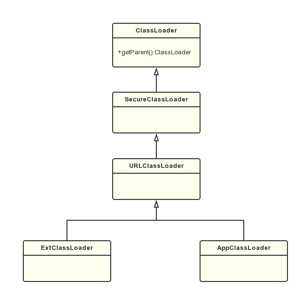
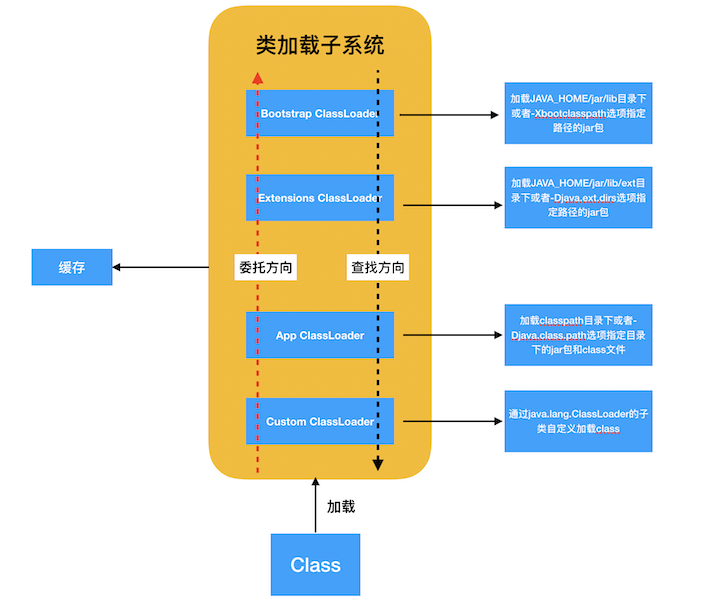

### 概述

>ClassLoader（类加载器）的功能是将`class`文件加载到JVM虚拟机中，让程序可以正确运行；但是，JVM启动的时候，并不会一次性加载所有的class文件，而是根据需要去动态加载，不然，一次性加载那么多class，会占用大量内存。

<!--more-->

### ClassLoader的类型

> Java中的类加载器主要有两种类型：系统类加载器和自定义类加载器。其中系统类加载器包括3中，分别是`Bootstrap ClassLoader`、`Extensions ClassLoader`、`App ClassLoader`。

#### Bootstrap ClassLoader

>启动类加载器，是Java类加载层次中最顶层的类加载器，是用C/C++实现的，负责加载JDK中的核心类库，如`rt.jar`、`resources.jar`、`charsets.jar`等。可以通过启动JVM时指定`-Xbootclasspath`来改变Bootstrap ClassLoader的加载目录。

获取该类加载器从哪些地方加载了相关的jar或class文件：

```java
// 方式一
System.out.println(System.getProperty("sun.boot.class.path"));
// 方式二
URL[] urls = Launcher.getBootstrapClassPath().getURLs();
for (int i = 0; i < urls.length; i++) {
    System.out.println(urls[i].toExternalForm());
}
```

运行结果：

```java
file:/Library/Java/JavaVirtualMachines/jdk1.8.0_111.jdk/Contents/Home/jre/lib/resources.jar
file:/Library/Java/JavaVirtualMachines/jdk1.8.0_111.jdk/Contents/Home/jre/lib/rt.jar
file:/Library/Java/JavaVirtualMachines/jdk1.8.0_111.jdk/Contents/Home/jre/lib/sunrsasign.jar
file:/Library/Java/JavaVirtualMachines/jdk1.8.0_111.jdk/Contents/Home/jre/lib/jsse.jar
file:/Library/Java/JavaVirtualMachines/jdk1.8.0_111.jdk/Contents/Home/jre/lib/jce.jar
file:/Library/Java/JavaVirtualMachines/jdk1.8.0_111.jdk/Contents/Home/jre/lib/charsets.jar
file:/Library/Java/JavaVirtualMachines/jdk1.8.0_111.jdk/Contents/Home/jre/lib/jfr.jar
file:/Library/Java/JavaVirtualMachines/jdk1.8.0_111.jdk/Contents/Home/jre/classes
```

#### Extensions ClassLoader

>扩展类加载器，负责加载Java的扩展类库，默认加载`Java_home/jre/lib/ext`目录下的所有jar。也可以通过`-Djava.ext.dirs`选项指定目录。

获取该类加载器的加载目录：

```java
System.out.println(System.getProperty("java.ext.dirs"));
```

运行结果：

```java
/Users/xch/Library/Java/Extensions:/Library/Java/JavaVirtualMachines/jdk1.8.0_111.jdk/Contents/Home/jre/lib/ext:
/Library/Java/Extensions:
/Network/Library/Java/Extensions:
/System/Library/Java/Extensions:/usr/lib/java
```

#### App ClassLoader

>负责加载当前应用程序classpath目录下的所有jar和class文件。也可以通过`-Djava.class.path`加载的路径。


#### Custom ClassLoader

>除了系统提供的类加载器，还可以自定义类加载器，自定义类加载器是通过继承`java.lang.ClassLoader`类的方式来实现自己的类加载器。


### ClassLoader的继承关系

获取一个类加载涉及到的类加载器：

```java
public class ClassLoaderTest {
    public static void main(String[] args) {
        ClassLoader loader = ClassLoaderTest.class.getClassLoader();
        while (loader != null) {
            System.out.println(loader);
            loader = loader.getParent();
        }
    }
}
```

运行结果：

```java
sun.misc.Launcher$AppClassLoader@135fbaa4
sun.misc.Launcher$ExtClassLoader@2503dbd3
```

说明：

- 第1行说明加载ClassLoaderTest的类加载器是AppClassLoader；
- 第2行说明APPClassLoader的父加载器为ExtClassLoader；
- 因为Bootstrap ClassLoader是由C/C++编写的，并不是一个Java类，所有无法在Java代码中获取它的引用。



- ClassLoader是一个抽象类，其中定义了ClassLoader的主要功能。
- SecureClassLoader继承了抽象类ClassLoader，但SecureClassLoader并不是ClassLoader的实现类，而是扩展了ClassLoader类加入了权限方面的功能，加强了ClassLoader的安全性。
- URLClassLoader继承自SecureClassLoader，用来通过URI路径从jar文件和文件夹中加载类和资源。
- &nbsp;ExtClassLoader和AppClassLoader都继承自URLClassLoader，它们都是Launcher的内部类，Launcher是Java虚拟机的入口应用，ExtClassLoader和AppClassLoader都是在Launcher中进行初始化的。

### ClassLoader加载类的原理

#### 原理介绍

>类加载器查找Class所采用的是`双亲委托模式`，所谓的双亲委托就是首先判断该Class是否已经加载，如果没有则不是自身去查找，而是委托给父加载器进行查找，一样依次的进行递归，直到委托到最顶层的Bootstrap ClassLoader，如果Bootstrap ClassLoader找到了该Class，就直接返回；如果没有找到，则继续依次向下查找；如果还没找到则最后会交给自身去查找。

#### 加载过程



>1. 自底向上检查类是否已经加载；
>2. 自顶向下尝试加载类。

Step1:：自定义类加载器首先从缓存中查找Class是否已经加载，如果已将加载就返回该Class；如果没加载，则委托给父加载器也就是App ClassLoader。

Step2：按照上图中红色虚线的方向递归步骤1.

Step3：一直委托到Bootstrap ClassLoader，如果Bootstrap ClassLoader在缓存中还没找到Class，则在自己规定路径`JAVA_HOME/jre/lib`中或者`Xbootclasspath`选项指定路径的jar包中进行查找，如果找到，则返回该Class；如果没有，则交给子加载器Extensions ClassLoader。

Step4：Extensions ClassLoader查找`JAVA_HOME/jre/lib/ext`目录下或者`-Djava.ext.dirs`选项指定目录下的jar包；如果找到就返回，找不到则交给App ClassLoader。

Step5：App ClassLoader查找`classpath`目录下或者`-Djava.class.path`选项所指定目录下的jar包或class文件，如果找到就返回，找不到就交给自定义的类加载器，如果还找不到则抛出异常。

```java
// ClassLoader中的loadClass方法
protected Class<?> loadClass(String name, boolean resolve) throws ClassNotFoundException {
    // 检查class是否已经被加载
    Class<?> c = findLoadedClass(name);
    if (c == null) {
        try {
            if (parent != null) {
                // 调用父类加载器的loadClass方法
                c = parent.loadClass(name, false);
            } else {
                // 调用Bootstrap ClassLoader查找
                c = findBootstrapClassOrNull(name);
            }
        } catch (ClassNotFoundException e) {
            // ClassNotFoundException thrown if class not found
            // from the non-null parent class loader
        }

        if (c == null) {
            // 向上委托没有找到该类，则调用findClass方法继续向下查找。
            c = findClass(name);
        }
    }
    return c;
}
```

#### 双亲委托模式的好处

1. 避免重复加载，如果已经加载过一次Class，就不需要再次加载，而是从缓存中直接读取。
2. 更加安全，如果不使用双亲委托模式，就可以自定义一个String类来替代系统的String类，这会造成安全隐患，采用双亲委托模式会使String类在虚拟机启动时就被Bootstrap ClassLoader加载，所以用户自定义的ClassLoader永远无法加载一个自己写的String，除非改变JDK中ClassLoader搜索类的默认算法。并且只有两个类名一致并且被同一个类加载器加载的类，Java虚拟机才会认为它们是同一个类。

### 自定义ClassLoader

> 系统提供的类加载器只能加载指定目录下的jar包和class文件，如果想要加载网络上或者其他地方的jar包或者class文件则需要自定义ClassLoader。

#### 自定义步骤

Step1：编写一个类继承自ClassLoader抽象类。

Step2：重写`findClass()`方法。

Step3：在`findClass()`方法中调用`defineClass()`。

**说明**：

> 在`findClass()`方法中定义查找class的方法，然后将class数据通过`defineClass()`生成Class对象。

#### 自定义示例

示例：自定义一个NetworkClassLoader，用于加载网络上的class文件

Step1. 创建NetworkClassLoader.java

```java
public class NetworkClassLoader extends ClassLoader {

    private String rootUrl;

    public NetworkClassLoader(String rootUrl) {
        this.rootUrl = rootUrl;
    }

    @Override
    protected Class<?> findClass(String name) throws ClassNotFoundException {
        Class clazz;
        byte[] classData = getClassData(name);
        if (classData == null) {
            throw new ClassNotFoundException();
        }
        clazz = defineClass(name, classData, 0, classData.length);
        return clazz;
    }

    private byte[] getClassData(String name) {
        InputStream is = null;

        try {
            String path = classNameToPath(name);
            URL url = new URL(path);
            byte[] buff = new byte[1024 * 4];
            int len;
            is = url.openStream();
            ByteArrayOutputStream baos = new ByteArrayOutputStream();
            while ((len = is.read(buff)) != -1) {
                baos.write(buff, 0, len);
            }
            return baos.toByteArray();
        } catch (Exception e) {
            e.printStackTrace();
        } finally {
            if (is != null) {
                try {
                    is.close();
                } catch (IOException e) {
                    e.printStackTrace();
                }
            }
        }
        return null;
    }

    private String classNameToPath(String name) {
        return rootUrl + "/" + name.replace(".", "/") + ".class";
    }

}
```

Step2. 创建用于网络加载的类NetworkClassLoaderTest.java

```java
package com.github.xch168.network;

public class NetworkClassLoaderTest {

    public void sayHello() {
        System.out.println("Hello from network class.");
    }
}
```

Step3. 将NetworkClassLoaderTest.java编译成NetworkClassLoaderTest.class并上传到七牛的对象存储服务器。


Step4. 创建测试类ClassLoaderTest.java

```java
public class ClassLoaderTest {

    public static void main(String[] args) {
        try {
            String rootUrl = "http://pkx097e6d.bkt.clouddn.com";
            NetworkClassLoader networkClassLoader = new NetworkClassLoader(rootUrl);
            String classname = "com.github.xch168.network.NetworkClassLoaderTest";
            Class clazz = networkClassLoader.loadClass(classname);
            System.out.println(clazz.getClassLoader());
            Object obj = clazz.newInstance();
            Method method = clazz.getDeclaredMethod("sayHello");
            method.invoke(obj, null);
        } catch (Exception e) {
            e.printStackTrace();
        }
    }
}
```

Step5. 执行ClassLoaderTest的main方法

运行结果：

```java
com.github.xch168.classloadertest.NetworkClassLoader@214c265e
Hello from network class.
```


### 参考链接

1. [Android解析ClassLoader（一）Java中的ClassLoader](https://blog.csdn.net/itachi85/article/details/78088701)
2. [一看你就懂，超详细java中的ClassLoader详解](https://blog.csdn.net/briblue/article/details/54973413)
3. [深入分析Java ClassLoader原理](https://blog.csdn.net/xyang81/article/details/7292380)